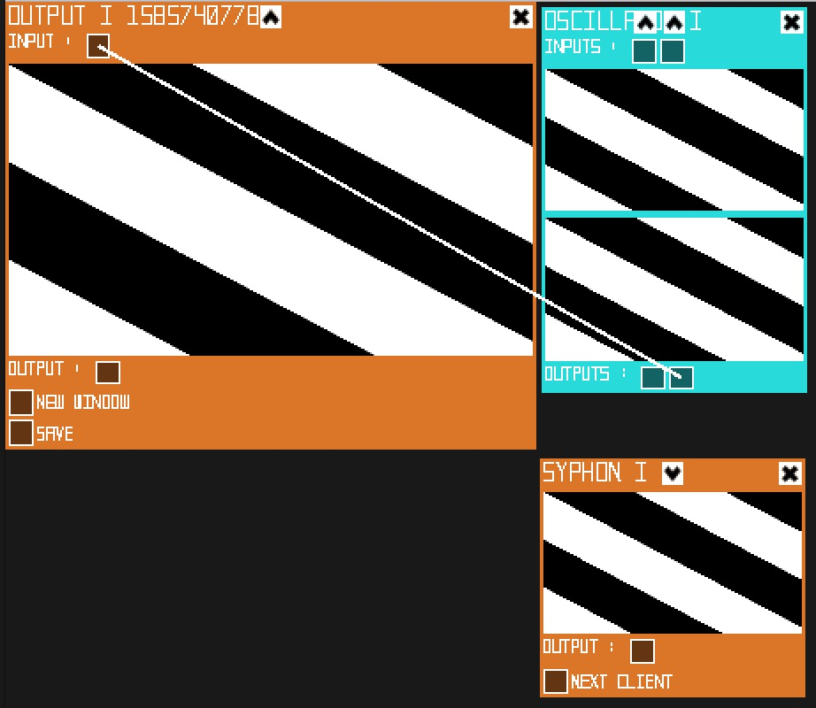

[](./doc/pictures/pic.01.jpg)

# ORAGE

Here is the source code and documentation of ORAGE.

* [Introduction](#introduction)
* [Inspiration](#inspiration)
* [State of art](#state-of-art)
* [Installation](#installation)
* [Contributes](#contributes)
* [Licence](#licence)

## Introduction

__ORAGE is a live visual modular synthetizer__</br></br>
As visual artist and developper, I think a part of my creativity comes from my shortcomings. Therefore, build my own visual softwares has always been obvious.
This tool is in fact the «whathousand» iteration of that idea to create that kind of software.
</br></br>
[TO DO -- description] c++(cinder)
</br></br>
Take a look at [ORAGE TV](https://www.youtube.com/channel/UCZ0oXcxj3lE8kQSSsniIZ6w) to see it in action.

## Inspiration

I'm inspired by analogic video synth as [LZX](https://lzxindustries.net/),<br/>
node programming visual generators as [cables.gl](https://cables.gl/home),<br/>digital video synth as [Lumen](https://lumen-app.com/),<br/>
glitch production softwares as [signal culture](http://signalculture.org/),<br/> 
this amazing tutorial [the book of shaders](https://thebookofshaders.com)<br/> and many others... <br/> Last but not least, I've been mainly inspired by my bandmate [Harold Osica](https://www.facebook.com/osicamusic).

## State of art

### Synthetizers

1. #### Matte
   
   [](./doc/modules/Matte.jpg)<br/>
   YPbPr is converted from the RGB video signal, which is split into three components: Y, PB, and PR. <br/>This color space has been choosen to have a better granularity control on brightness and tint. <br/>
   
   - __Input__ : None
   - __Output__ : Unicolor video output signal.
   - __Y__ : Luma (brightness or luminance) information. 
   - __Pb__ : the difference between blue and luma.
   - __Pr__ : the difference between red and luma.
     
     ```
     R = Y + 1.574f * Pr
     G = Y - 0.187f * Pb - 0.469f * Pr
     B = Y + 1.856f * Pb
     ```

2. #### Oscillator
   
   [](./doc/modules/Oscillator.jpg)<br/>
   
   - __Input__ : 
     - __A__ : __Mod__ intensity video input signal.
     - __B__ : Color video input signal.
   - __Output__ : 
     - __A__ : Oscillator video output signal.
     - __B__ : Trailed video output signal.
   - __Hz__ : Frequency of the oscillation.
   - __Sync__ : Synchronisation of the frequency on Horizontal/Vertical axes.
   - __Dx__ : Offset the phase of the oscillation.
   - __Dy__ : Offset the Intensity of the oscillation.
   - __Mod__ : Offset the phase of the oscillation depending on __Input A__.
   - __Trail__ : A curious way to keep trace of lasts states of the oscillator.
   - __Sine__ : Intensity of the Sinus wave.
   - __Saw__ : Intensity of the Saw wave.
   - __Tri__ : Intensity of the Triangular wave.
   - __Noise__ : Intensity of the Noise wave.
   - __Exp__ : A curious way to contrast the signal of the oscillator.

3. #### Cloud
   
   [](./doc/modules/Cloud.jpg)<br/>
   [TO DO -- description]

### Filters

4. #### Mosher
   
   [](./doc/modules/Mosher.jpg)<br/>
   
   - __Input__ : 
     - __A__ : video input signal to filter.
     - __B__ : video input signal to callibrate the filter.
   - __Output__ : Scaled video output signal.
   - __Gain__ : Scale factor.
   - __X__ : Offset the horizontal position of the anchor point.
   - __Y__ : Offset the vertical position of the anchor point.

5. #### Spliter
   
   [](./doc/modules/Spliter.jpg)<br/>
   
   - __Input__ : 
     - __A__ : video input signal to filter.
     - __B__ : video input signal to filter.
   - __Output__ : 
     - __A__ : max(Input A - Input B, 0).
     - __B__ : max(Input B - Input A, 0).

6. #### Crossfader
   
   [](./doc/modules/Crossfader.jpg)<br/>
   
   - __Input__ : 
     - __A__ : video input signal to filter.
     - __B__ : video input signal to filter.
   - __Output__ : Mixed video output signal.
   - __Blend__ : Select filters : 
     - Add : min(A + B, 1)
     - Normal : A
     - Lighten : max(A, B)
     - Darken : min(A, B)
     - Multiply : A x B
     - Average : (A + B) / 2
     - Substract : max(A + B - 1, 0)
     - Difference : abs(A - B)
     - Negation : (1 - abs(1 - A - B))
     - Exclusion : A + B - 2.0 * A * B
     - Phoenix : (min(A, B) - max(A, B) + 1)
     - Overlay : (A < 0.5 ? (2.0 * A * B) : (1.0 - 2.0 * (1.0 - A) * (1.0 - B)))
     - HardMix : ((BlendVividLight(A, B) < 0.5) ? 0.0 : 1.0)
       - BlendVividLight : ((B < 0.5) ? BlendColorBurnf(A, (2.0 * B)) : BlendColorDodgef(A, (2.0 * (B - 0.5))))
       - BlendColorBurnf : ((B == 0.0) ? B : max((1.0 - ((1.0 - A) / B)), 0.0))
       - BlendColorDodgef : ((B == 1.0) ? B : min(A / (1.0 - B), 1.0))
   - __Crossfade__ : Mix Inputs __A__ · __B__

7. #### Tile
   
   [](./doc/modules/Tile.jpg)<br/>
   [TO DO -- description]

8. #### Freezer
   
   [](./doc/modules/Freezer.jpg)<br/>
   [TO DO -- description]

9. #### Color Adjustement
   
   [](./doc/modules/ColorAdjustement.jpg)<br/>
   [TO DO -- description]

10. #### Tint Corrector
    
    [](./doc/modules/TintCorrector.jpg)<br/>
    [TO DO -- description]

11. #### Delay
    
    [](./doc/modules/Delay.jpg)<br/>
    [TO DO -- description]

12. #### Resize
    
    [](./doc/modules/Resize.jpg)<br/>
    [TO DO -- description]

13. #### Blur
    
    [](./doc/modules/Blur.jpg)<br/>
    [TO DO -- description]

14. #### Kaleidoscope
    
    [](./doc/modules/Kaleidoscope.jpg)<br/>
    [TO DO -- description]

### Controllers

15. #### Lfos
    
    [](./doc/modules/Lfo.jpg)<br/>
    [TO DO -- description]
16. #### Random
    
    [](./doc/modules/Random.jpg)<br/>
    [TO DO -- description]
17. #### ProcessCV
    
    [](./doc/modules/ProcessCV.jpg)<br/>
    [TO DO -- description]

### Players

18. #### SyphonInput
    
    [](./doc/modules/SyphonInput.jpg)<br/>
    [TO DO -- description]
19. #### Player
    
    [](./doc/modules/Player.jpg)<br/>
    [TO DO -- description]

### Outputs

20. #### Output
    
    [](./doc/modules/Output.jpg)<br/>
    [TO DO -- description]

## Installation

Currently available only on OSX(10.13.6). <br/>
[Download](https://github.com/oogre/ORAGE/releases)

## Contributes

This software is written in C++([cinder](https://github.com/cinder/Cinder))<br/>
The user interface is build thanks to [UI](https://github.com/rezaali/Cinder-UI) cinder block from [Reza Ali](https://www.syedrezaali.com/)<br/>
Let me know your [ideas, needs or issues](https://github.com/oogre/ORAGE/issues)<br/>
Fork this repository and feel free to propose new functionalities or upgrade.<br/>

## Licence

[](https://creativecommons.org/licenses/by-nc-sa/4.0/)