[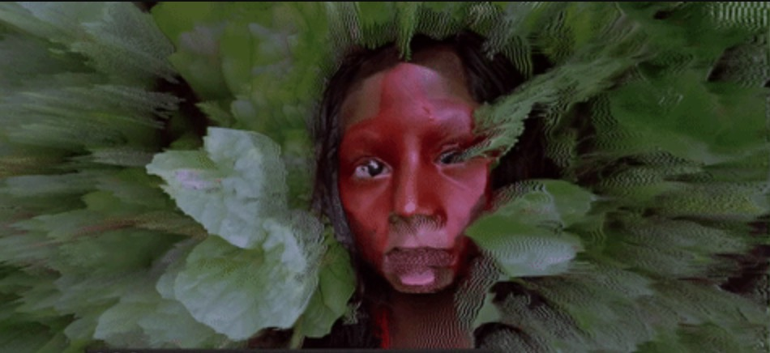](./doc/pictures/pic.01.jpg)

# ORAGE
Here is the source code and documentation of ORAGE.

* [Introduction](#introduction)
* [Inspiration](#inspiration)
* [State of art](#state-of-art)
* [Installation](#installation)
* [Contributes](#contributes)
* [Licence](#licence)

## Introduction
__ORAGE is a live visual modular synthetizer__</br></br>
As visual artist and developper, I think a part of my creativity comes from my shortcomings. Therefore, build my own visual softwares has always been obvious.
This tool is in fact the «whathousand» iteration of that idea to create that kind of software.
</br></br>
[TO DO -- description] c++(cinder)
</br></br>
Take a look at [ORAGE TV](https://www.youtube.com/channel/UCZ0oXcxj3lE8kQSSsniIZ6w) to see it in action.
## Inspiration
I'm inspired by analogic video synth as [LZX](https://lzxindustries.net/),<br/>
node programming visual generators as [cables.gl](https://cables.gl/home),<br/>digital video synth as [Lumen](https://lumen-app.com/),<br/>
glitch production softwares as [signal culture](http://signalculture.org/),<br/> 
this amazing tutorial [the book of shaders](https://thebookofshaders.com)<br/> and many others... <br/> Last but not least, I've been mainly inspired by my bandmate [Harold Osica](https://www.facebook.com/osicamusic).
## State of art
### Matte 
[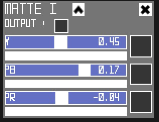](./doc/modules/Matte.jpg)<br/>
YPbPr is converted from the RGB video signal, which is split into three components: Y, PB, and PR. This color space has been choosen to have a better control on brightness and tint. 
Y : Luma (brightness or luminance) information. 
Pb : the difference between blue and luma.
Pr : the difference between red and luma.
```
    R = Y + 1.574f * Pr
    G = Y - 0.187f * Pb - 0.469f * Pr
    B = Y + 1.856f * Pb
```
### Oscillator
[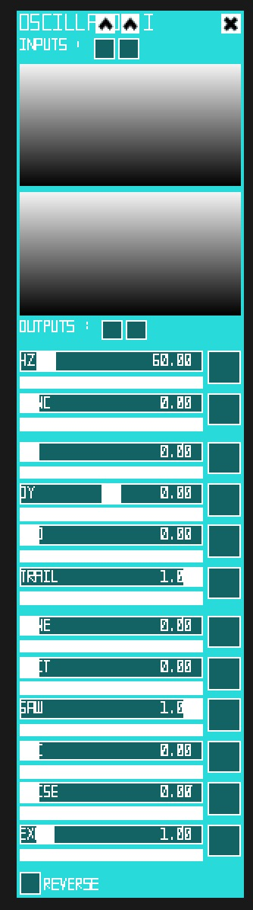](./doc/modules/Oscillator.jpg)<br/>
[TO DO -- description]
### Cloud
[](./doc/modules/Oscillator.jpg)<br/>
[TO DO -- description]
### Mosher
[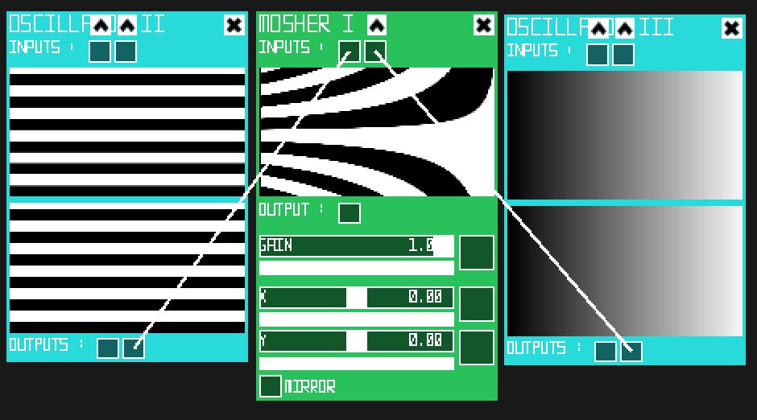](./doc/modules/Mosher.jpg)<br/>
[TO DO -- description]
### Spliter
[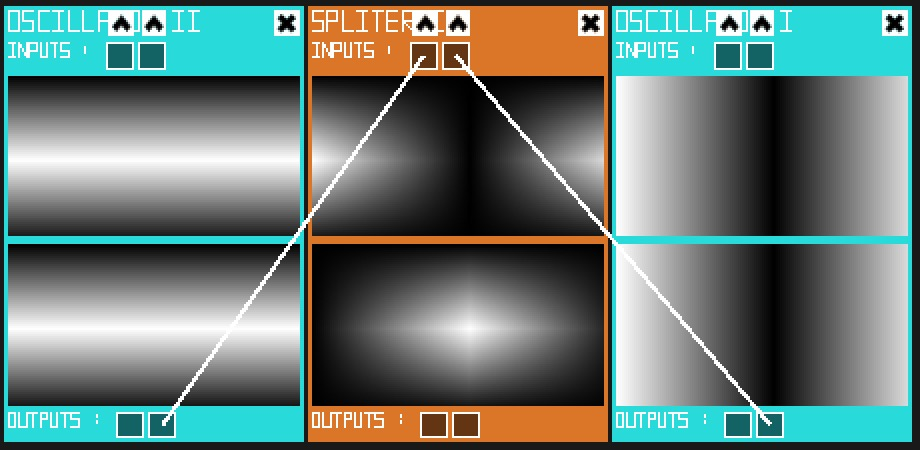](./doc/modules/Spliter.jpg)<br/>
[TO DO -- description]
### Crossfader
[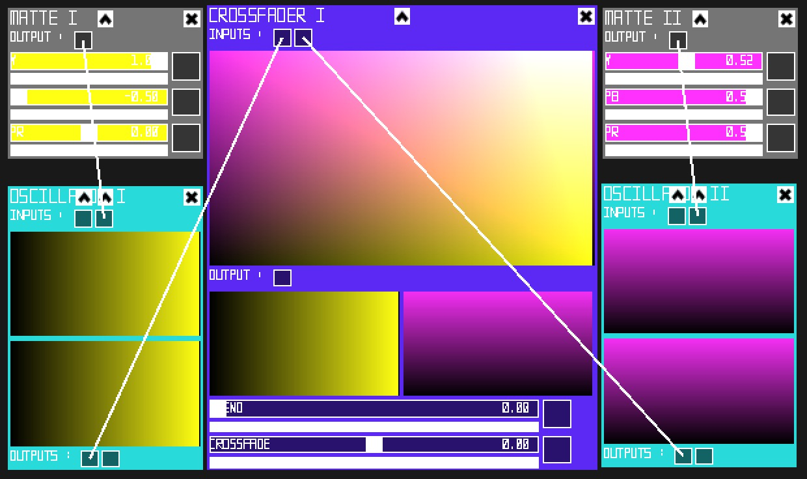](./doc/modules/Crossfader.jpg)<br/>
[TO DO -- description]
### Tile
[](./doc/modules/Tile.jpg)<br/>
[TO DO -- description]
### Freezer
[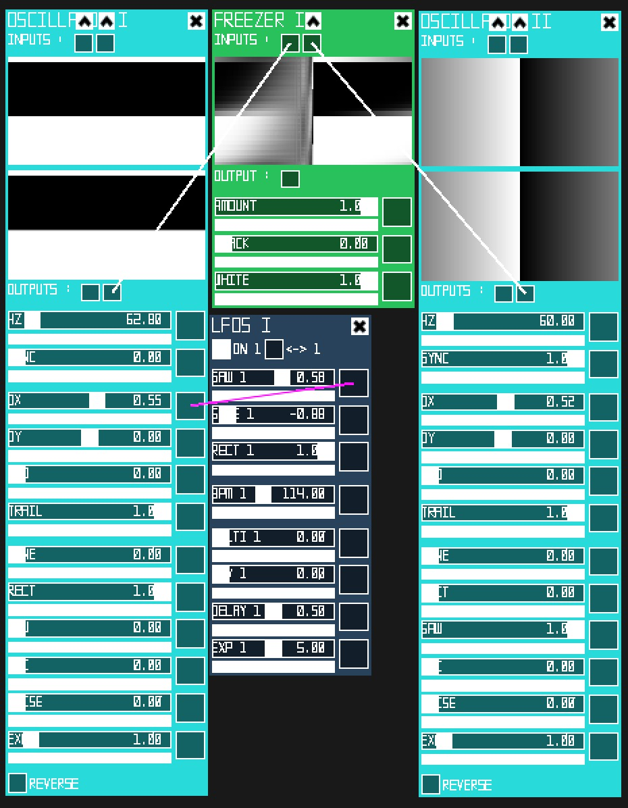](./doc/modules/Freezer.jpg)<br/>
[TO DO -- description]
### ColorAdjustement
[](./doc/modules/ColorAdjustement.jpg)<br/>
[TO DO -- description]
### TintCorrector
[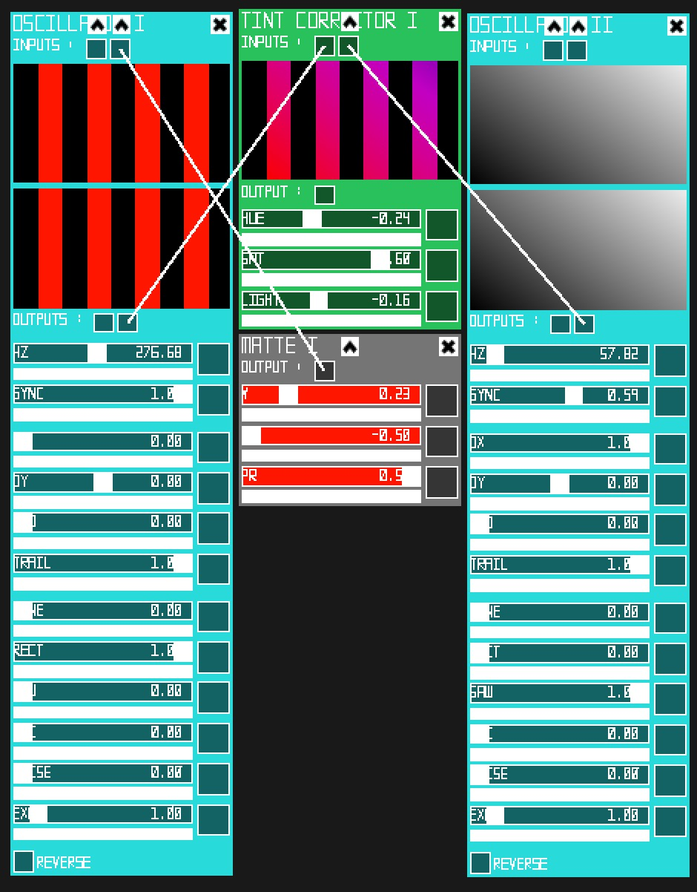](./doc/modules/TintCorrector.jpg)<br/>
[TO DO -- description]
### Delay
[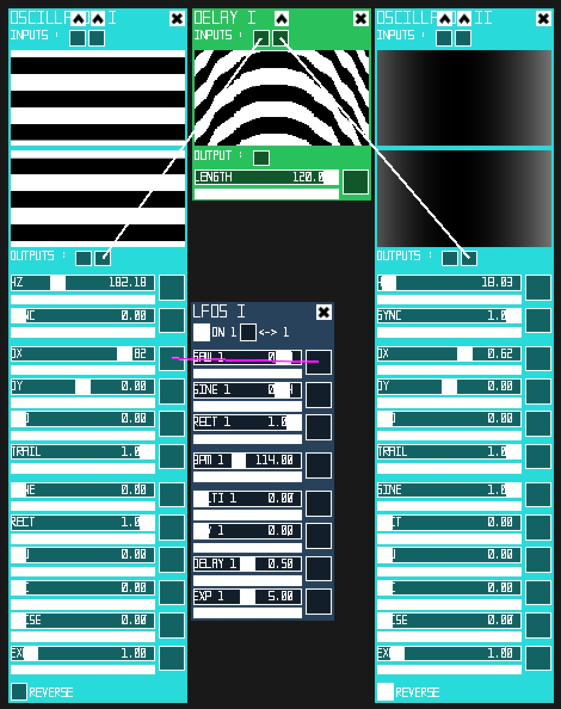](./doc/modules/Delay.jpg)<br/>
[TO DO -- description]
### Resize
[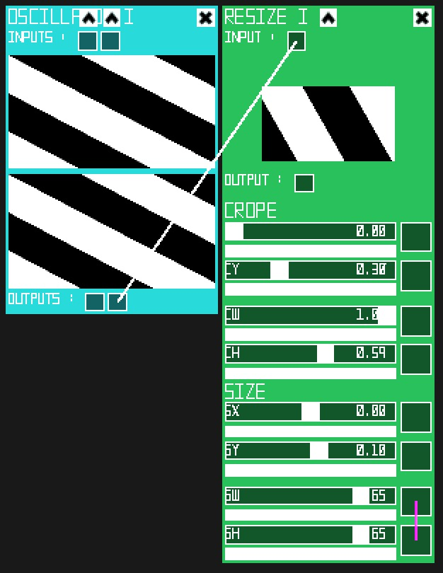](./doc/modules/Resize.jpg)<br/>
[TO DO -- description]
### Blur
[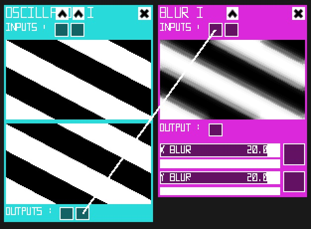](./doc/modules/Blur.jpg)<br/>
[TO DO -- description]
### Kaleidoscope
[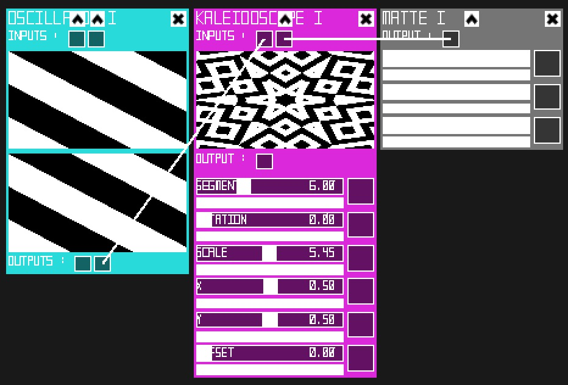](./doc/modules/Kaleidoscope.jpg)<br/>
[TO DO -- description]
### Lfos
[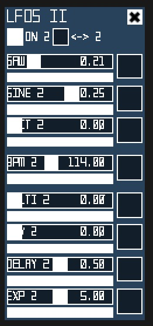](./doc/modules/Lfo.jpg)<br/>
[TO DO -- description]
### Random
[](./doc/modules/Random.jpg)<br/>
[TO DO -- description]
### ProcessCV
[](./doc/modules/ProcessCV.jpg)<br/>
[TO DO -- description]
### SyphonInput
[](./doc/modules/SyphonInput.jpg)<br/>
[TO DO -- description]
### Player
[](./doc/modules/Player.jpg)<br/>
[TO DO -- description]
### Output
[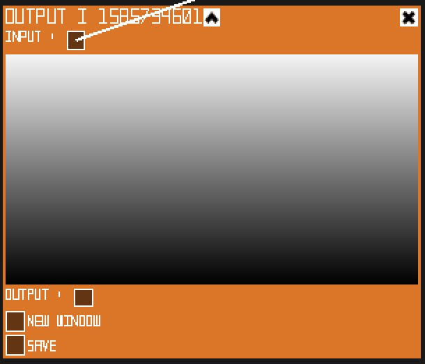](./doc/modules/Output.jpg)<br/>
[TO DO -- description]

## Installation
Currently available only on OSX(10.13.6). <br/>
[Download](https://github.com/oogre/ORAGE/raw/master/Orage.app.zip)
## Contributes
This software is written in C++([cinder](https://github.com/cinder/Cinder))<br/>
The user interface is build thanks to [UI](https://github.com/rezaali/Cinder-UI) cinder block from [Reza Ali](https://www.syedrezaali.com/)<br/>
Let me know your [ideas, needs or issues](https://github.com/oogre/ORAGE/issues)<br/>
Fork this repository and feel free to propose new functionalities or upgrade.<br/>
## Licence
[](https://creativecommons.org/licenses/by-nc-sa/4.0/)